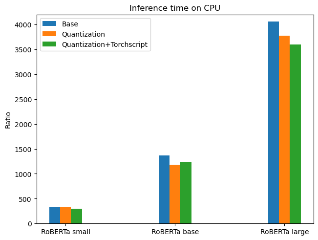
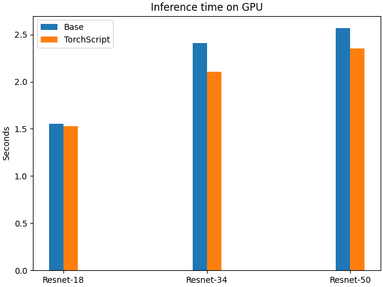

## Code
### Resnet
Resnet-1.py is for 1 GPU with baseline and mixed precision.
```
python Resnet-1.py
```

Resnet-2.py is for dataparallel with 1,2,4 GPUs.
```
torchrun Resnet-2.py [18/34/50] [1/2/4] [0/1]
```
The first argument determines size of the model, the second indicates number of GPUs, and the third for turing on or off mixed precision.

Resnet-3.py is for Distributed dataparallel for 1,2,4 GPUs.
```
torchrun --nproc-per-node [1/2/4] Resnet-3.py [18/34/50] [1/2/4] [0/1]
```
The first argument determines size of the model, the second indicates number of GPUs, and the third for turing on or off mixed precision. The `--nproc-per-node` must match the number of GPUs.

Resnet-4.py is for evaluating torchscript and Quantization on CPUs.
```
python Resnet-4.py -q [0/1] -r [18/34/50] -m [0/1] -ts [0/1]
```
It will try to load the models from the models/ directory, and -q -r -m -ts specifies the quantization, resnet size, mixed precision and using torchscript.

Resnet-5 is for evaluating torchscript on GPU.
```
python Resnet-4.py -m [0/1] -r [18/34/50]
```
The -m refers to mixed precisoin, and -r refers to Resnet size. The program will use the specified model with and without Torchscript.

### RoBERTa

`nlp_utils.py` contains the utility functions for loading the dataset and preprocessing the data.
`main.py` contains the code for training and evaluating the RoBERTa model.
`inference.py` contains the code for evaluating the RoBERTa model on the test set.

In order to retrain the model and reproduce our experiments results, run the following command:
```
CUDA_VISIBLE_DEVICES=$1 python -m torch.distributed.launch --nproc_per_node=$2 main.py --model_name $3 --batch-size $4 [--mixed]
```
The first argument specifies the GPU id, the second specifies the number of GPUs, the third specifies the model name, and the fourth specifies the batch size. Use `--mixed` to enable mixed precision.

To be more specific, if you want to reproduce the results of training RoBERTa-base on 4 GPUs with batch size 32 per GPU and mixed precision, run the following command:
```
CUDA_VISIBLE_DEVICES=0,1,2,3 python -m torch.distributed.launch --nproc_per_node=4 main.py --model_name xlm-roberta-base --batch-size 32 --mixed
```

In order to reproduce the inference experiments, run the following command:
```
CUDA_VISIBLE_DEVICES=$1 python inference.py --model_name $2 [--script] [--quantize]
```
The first argument specifies the GPU/CPU. Use `--script` to enable TorchScript and `--quantize` to enable quantization.

To be more specific, if you want to reproduce the results of inference on RoBERTa-base with TorchScript and quantization on CPU, run the following command:
```
CUDA_VISIBLE_DEVICES="" python inference.py --model_name xlm-roberta-base --script --quantize
```

## The Results
### Training Phase
The approaches speeds up the traning of the model significantly. Interestingly, the mixed precision works exceptionally well with one GPU, and provides less speedup when used on multiple GPUs.  
  

The batch size also affects training time. For example, this is a graph comparing two batch sizes using 4 GPUs. As a larger batch size enables faster training, it is used in the graph above.  
  


## Inference Phase
The Quantization is only supported on CPUs. And combined with TorchScript, it can slightly reduce inference time. Quantization itself does not do much, as the overhead it introduces outweights the benefit.  
  

TorchScript can significantly speed up inference on GPUs.  



### Observations and Conclusions